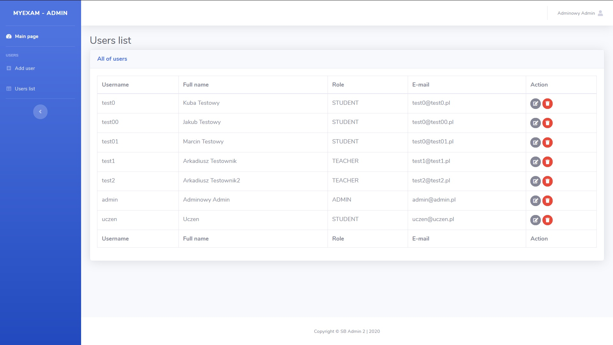
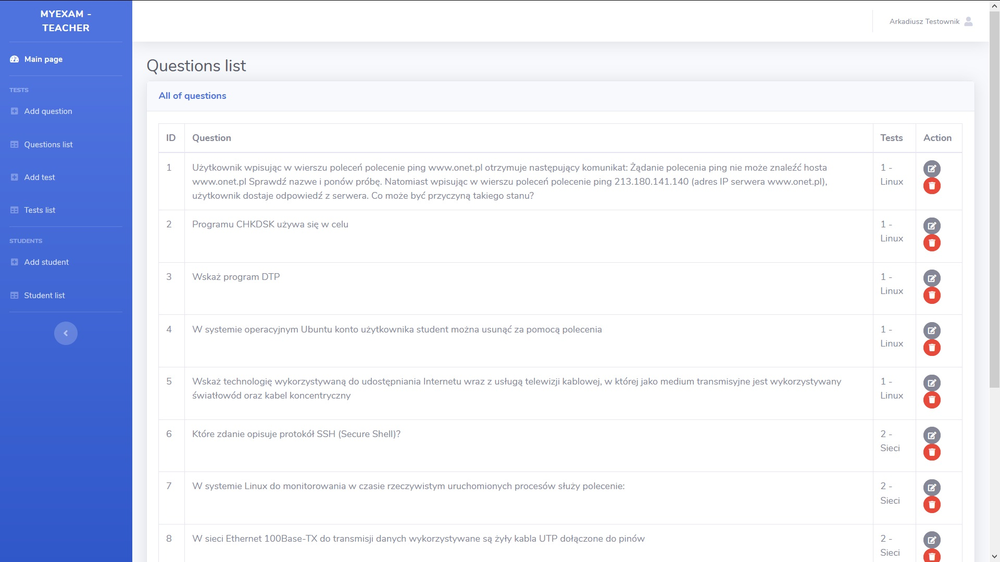
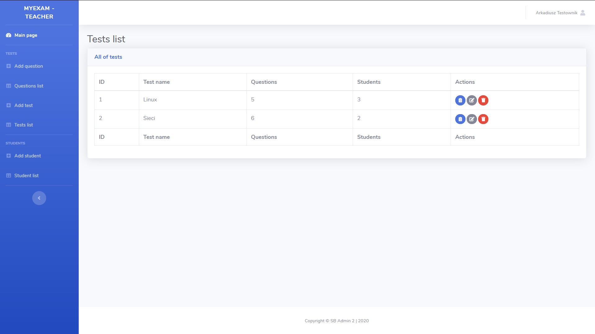
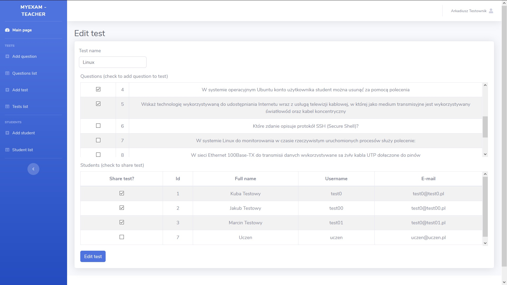
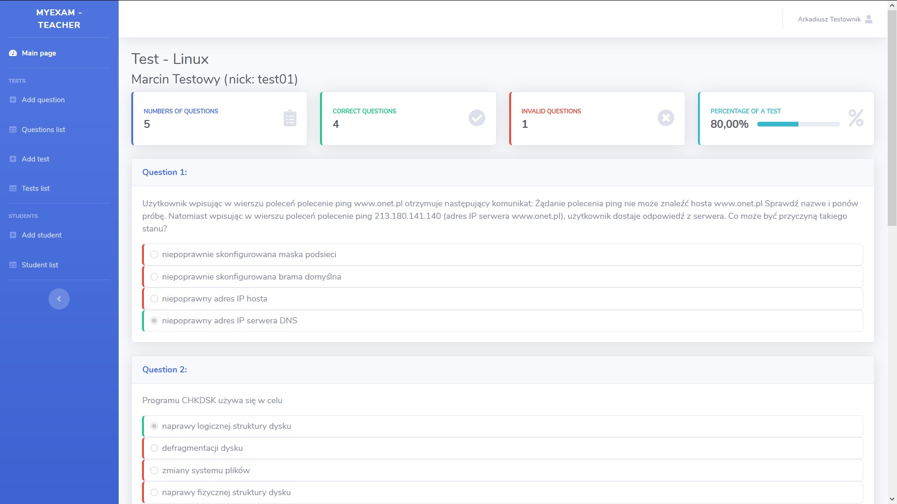

# MyExam
The application was created as a student project. This is a website for teachers and students to create online exams (one choice). Teacher prepares a database of questions and make test from them, choosing simultaneously students who must take this test. Then student will take a test and afterwards will see result (with correct and uncorrect answers) - also teacher can see the results. 

## Technologies
* Java 8
* Spring Boot
* Spring MVC
* Spring Data JPA
* Spring Security
* Hibernate 5
* MySQL
* Bootstrap 4
* Thymeleaf

## Screenshots

---

---

---

---

